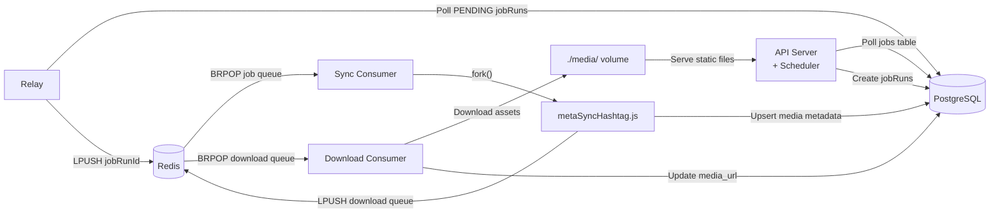

# Hashtag Sync System — Complete Design Decisions

All decisions below were confirmed through a systematic design review interview.

---

## Architecture Overview



### 4 Processes (Decoupled Services)
| # | Process | Responsibilities |
|---|---------|-----------------|
| 1 | **API Server + Scheduler** | Express API (`POST /schedule`, `GET /hashtags`), scheduler poll loop, job seeding, static file serving |
| 2 | **Relay** | Polls `jobRuns` for `PENDING` → pushes to Redis job queue |
| 3 | **Sync Job Consumer** | BRPOP on job queue → forks child process → executes handler |
| 4 | **Download Consumer** | BRPOP on download queue → downloads media assets → updates DB |

### Infrastructure
- **Postgres**: Primary data store (jobs, jobRuns, media)
- **Redis**: Raw LPUSH/BRPOP lists (2 queues: job queue + download queue)
- **Multi-Process Node**: 4 decoupled processes running concurrently
- **Local Storage**: `./media/` directory served statically by API server

---

## Scheduler Service

| Parameter | Value |
|-----------|-------|
| Poll interval | 30 seconds |
| Batch size | 50 jobs per poll |
| Concurrency | Multi-instance via `SELECT ... FOR UPDATE SKIP LOCKED` |

### Missed Tick Recovery
- **Strategy**: Fire ONE catch-up sync, then reset `nextRunAt = now() + interval`
- **Schedule drift**: Accepted (floating schedule, not cron-aligned)
- **Rationale**: Fetching the same recent media 4 times after downtime is redundant

### `POST /schedule` Request Body
```json
{
  "jobType": "once" | "recurring",
  "jobValue": "<ISO timestamp>" | "<cron expression>",
  "fileName": "metaSyncHashtag.js",
  "payload": {
    "hashtag": "matcha",
    "mediaType": "top_media" | "recent_media"
  }
}
```

### Input Validation
| Rule | Behavior |
|------|----------|
| Past timestamp for `once` jobs | 400 error |
| Malformed cron expression | 400 error |
| Minimum interval guard | None (no restriction) |
| Duplicate job (same fileName + jobType + jobValue) | Rejected by `UNIQUE (fileName, jobType, jobValue)` on `jobs` table |

### Job Management
- **No management API** — no pause/resume/cancel/update endpoints
- Changes require code/DB modifications, not runtime API calls

### Authentication
- **No auth** on `POST /schedule` — documented as a trade-off

### Job Seeding
- On API server boot: check if matcha sync jobs exist, create if not
- Two recurring jobs seeded:
  1. `metaSyncHashtag.js` — `0 */3 * * *` — `{hashtag: "matcha", mediaType: "top_media"}`
  2. `metaSyncHashtag.js` — `0 */3 * * *` — `{hashtag: "matcha", mediaType: "recent_media"}`
- If seeding fails (e.g., DB not ready): process exits, Docker restarts it
- Duplicate seeding (on restart): handled by `UNIQUE` constraint (ON CONFLICT DO NOTHING)

---

## Relay

| Parameter | Value |
|-----------|-------|
| Poll interval | 5-10 seconds (aggressive) |
| Batch size | 50 |
| Max retries | 3 (durable, tracked in DB via `relayRetryCount`) |
| Failure state | `relayStatus = 'FAILED'` after 3 retries |
| Manual retry | Expose mechanism to retry FAILED relays (future/TODO) |

### Crash Recovery
- Relay crash after push but before UPDATE → row stays `PENDING` → relay re-polls → pushes duplicate → consumer is idempotent (`UPDATE ... WHERE status = 'QUEUED'`) → harmless

### Queue Message Content
- **Only the jobRun ID** — consumer fetches full row from DB on pickup

---

## Consumer (Sync Jobs)

### Execution Model
- **child_process.fork()** — handler runs in isolated child process
- Error isolation: crashed handler doesn't take down consumer
- **Inputs via environment variables**: payload + infrastructure config (DB, API tokens)

### Timeout
- **5 minutes** fixed timeout — child process killed, jobRun marked `FAILED`

### Failure Handling
- **FAILED is terminal** — no consumer-level retries
- Recurring jobs self-heal on next tick (3 hours later)
- Once jobs that fail are lost permanently (accepted for this scope)

### Stuck Job Recovery (PICKED but never completed)
- **TODO**: Implement a stuck job detector (periodic sweep marking PICKED rows older than X minutes as FAILED)
- Not implemented in initial version — documented as trade-off

### Idempotency
- `UPDATE jobRuns SET status = 'PICKED' WHERE id = :id AND status = 'QUEUED'`
- 0 rows affected → duplicate delivery, skip (ack without processing)

---

## Sync Handler (`metaSyncHashtag.js`)

### Flow
1. Read `mediaType` from payload (`top_media` or `recent_media`)
2. Call Meta's hashtag name-to-ID API to resolve hashtag ID at runtime
3. Fetch pages from Meta's `/{hashtag_id}/{mediaType}` endpoint
4. For each page (25 items): upsert media metadata in a single transaction (page-level atomicity)
5. Accumulate `[{mediaId, mediaURL}]` across all pages
6. After all pages: LPUSH batch to Redis download queue

### Pagination
- Follow `next` cursor links
- Max 20 pages (500 items at 25/page) — stop even if more pages exist

### Rate Limiting
- Basic retry with exponential backoff on 429 responses within the handler

### One Handler File
- `metaSyncHashtag.js` — parameterized by `mediaType` from payload
- Both top_media and recent_media use the same handler

---

## Download Consumer

### Flow
1. BRPOP from download queue
2. Receive batch `[{mediaId, mediaURL}]`
3. Download each asset concurrently (pool of ~10 parallel downloads via p-limit)
4. Save to `./media/{media_id}.{ext}` (extension parsed from URL path)
5. Update `media_url` in DB to `http://localhost:3000/media/{media_id}.{ext}`

### Fallback for Failed Downloads
- **Happy path**: Direct Redis push → consumer downloads
- **TODO**: Periodic sweep job for `localPath IS NULL` with retry tracking

---

## Data Model

### `jobs` Table
| Column | Type | Notes |
|--------|------|-------|
| id | UUID (v4) | Primary key |
| jobType | `'once'` \| `'recurring'` | |
| jobValue | String | ISO timestamp or cron expression |
| fileName | String | Handler file name |
| payload | JSONB | Copied to jobRuns on each tick |
| active | Boolean | `false` after `once` job fires |
| nextRunAt | Timestamp | Next scheduled execution |
| createdAt | Timestamp | |

**Constraints**: `UNIQUE (fileName, jobType, jobValue)`

### `jobRuns` Table
| Column | Type | Notes |
|--------|------|-------|
| id | UUID (v4) | Primary key |
| jobId | UUID | FK to jobs |
| nextRunAt | Timestamp | Snapshot at creation time |
| payload | JSONB | Copied from job |
| relayStatus | `'PENDING'` \| `'SENT'` \| `'FAILED'` | Owned by relay |
| relayRetryCount | Integer | Durable retry tracking |
| sentAt | Timestamp | |
| status | `'QUEUED'` \| `'PICKED'` \| `'SUCCESS'` \| `'FAILED'` | Owned by consumer |
| errorMessage | Text | |
| createdAt | Timestamp | |

**Constraints**: `UNIQUE (jobId, nextRunAt)`

### `media` Table
| Column | Type | Notes |
|--------|------|-------|
| hashtag_name | String | Part of composite PK |
| media_id | String | Meta's Instagram media ID, part of composite PK |
| media_type | String | IMAGE, VIDEO, CAROUSEL_ALBUM |
| timestamp | Timestamp | From Meta |
| permalink | String | Instagram permalink |
| caption | Text | Nullable, can be very long |
| like_count | Integer | Nullable (sometimes missing from API) |
| comments_count | Integer | |
| sync_type | String | `top_media` or `recent_media` (last-write-wins on upsert) |
| synced_at | Timestamp | When last ingested/updated |
| source_url | Text | Original Meta temp CDN URL (for audit) |
| media_url | Text | Nullable — local URL once downloaded (e.g., `http://localhost:3000/media/...`) |
| createdAt | Timestamp | Row creation time |

**Primary Key**: `(hashtag_name, media_id)`
**Deduplication**: `INSERT ON CONFLICT (hashtag_name, media_id) DO UPDATE` — refreshes metadata (like_count, comments_count, etc.)
**Carousel handling**: Stored as single row, only cover image downloaded

---

## API: `GET /hashtags`

| Parameter | Value |
|-----------|-------|
| Pagination | Cursor-based (`createdAt` + `id` as composite, encoded as opaque token) |
| Page size | 25 (fixed, matches Meta's default) |
| Sort order | Descending by creation time |
| `media_url` | Returns local URL if downloaded, falls back to `source_url` if not — client always gets a URL |

---

## Technology Stack

| Component | Choice |
|-----------|--------|
| Runtime | Express + TypeScript |
| ORM | Prisma (schema-first, type-safe, built-in migrations) |
| Database | Postgres |
| Queue | Redis raw lists (LPUSH/BRPOP) — 2 lists (jobs + downloads) |
| Storage | Local file system (`./media/`) behind interface (swappable for S3) |
| IDs | UUID v4 everywhere |
| Logging | Structured (pino or winston) with service-name tags |
| Containerization | None (Local multi-process architecture) |

---

## Trade-offs & TODOs (for `instructions.md`)

| Item | Status |
|------|--------|
| No auth on `POST /schedule` | Trade-off |
| No management API (pause/resume/cancel) | Trade-off |
| No health check endpoints | Trade-off — rely on process supervisor |
| Stuck job detector (PICKED → FAILED after timeout) | TODO |
| Periodic sweep for failed downloads (`localPath IS NULL`) | TODO |
| Data retention / jobRuns cleanup cron | TODO |
| Carousel children not fetched (cover image only) | Trade-off |
| Schedule drift on missed tick recovery | Trade-off (floating, not cron-aligned) |
| No minimum cron interval guard | Trade-off |

---

## Project Structure

```
src/
├── api/              # Express routes (POST /schedule, GET /hashtags)
├── scheduler/        # Scheduler poll loop
├── relay/            # Relay poll loop
├── consumer/         # Sync job consumer + download consumer
├── shared/           # Prisma client, Redis connection, queue interface, logger, config
├── handlers/         # metaSyncHashtag.js (child process entry point)
prisma/
├── schema.prisma
├── migrations/
.env
instructions.md
```
